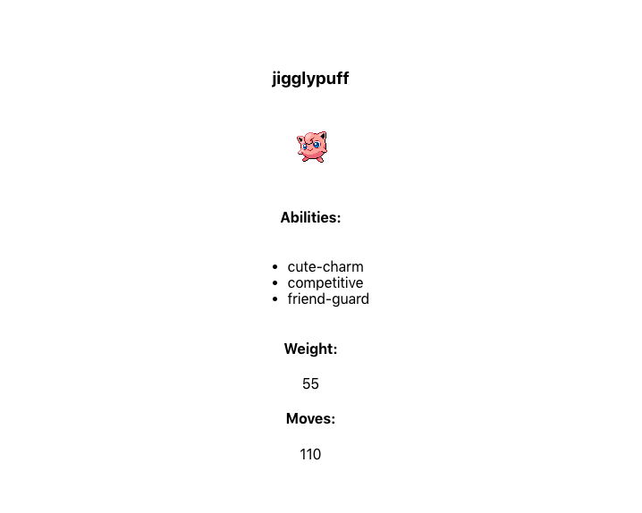

This project was bootstrapped with [Create React App](https://github.com/facebook/create-react-app).

## Available Scripts

In the project directory, you can run:

### `npm install` and `npm start`

Runs the app in the development mode. 
Open [http://localhost:3000](http://localhost:3000) to view it in the browser.

The page will reload if you make edits. 
You will also see any lint errors in the console.

## Opdrachtbeschrijving

Maak een webpagina die direct de gegevens over Pokemon *Jigglypuff* ophaalt door gebruik te maken van de [pokémon API](https://pokeapi.co/). 

Display de volgende informatie:
1. Naam van de pokémon
2. Afbeelding (sprite)
3. Lijst van _abilities_
4. Gewicht van de pokémon

*Bonus*: de hoeveelheid moves die deze pokémon heeft (tip: dit kun je zelf berekenen!)
### What the page should look like

